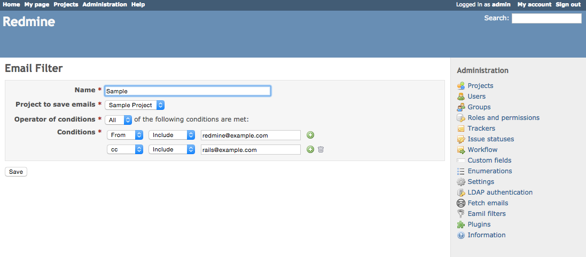

# Redmine Email Filter

Redmine plugin for filtering email ticket creation.

When an email is received (by Redmine default rake task with cron, or by plugins),
this plugin checks defined conditions. If the conditions are fulfilled, received 
email is saved as a ticket into defined project.

## Usage

Add a filter.

Add some conditions.

## Supported versions

Testing only Redmine 3.0

## Install

To install the plugin clone the repo from github and migrate the database:

    cd /path/to/redmine/
    git clone git://github.com/vohedge/redmine_email_filter.git plugins/redmine_email_filter
    rake redmine:plugins:migrate RAILS_ENV=production

To uninstall the plugin migrate the database back and remove the plugin:

    cd /path/to/redmine/
    rake redmine:plugins:migrate NAME=redmine_email_filter VERSION=0 RAILS_ENV=production
    rm -rf plugins/redmine_email_filter

Further information about plugin installation can be found at: http://www.redmine.org/wiki/redmine/Plugins

## Cron

Example

    */30 * * * * redmineuser rake -f /path/to/redmine/appdir/Rakefile redmine:email:receive_imap RAILS_ENV="production" host=imap.foo.bar username=redmine@somenet.foo password=xxx

See [Receiving emails](http://www.redmine.org/projects/redmine/wiki/RedmineReceivingEmails)

## Contribute

### How to test

    $ cd /path/to/redmine
    $ bundle exec rake redmine:plugins:test NAME=redmine_email_filter

### Pull Request

1.Fork it
2.Create your feature branch: git checkout -b new-feature
3.Commit your changes: git commit -am 'add some new feature'
4.Push to the branch: git push origin new-feature
5.Create new Pull Request

## Copyright

Copyright (c) 2015 Noah Kobayashi Released under the MIT license
http://opensource.org/licenses/mit-license.php

